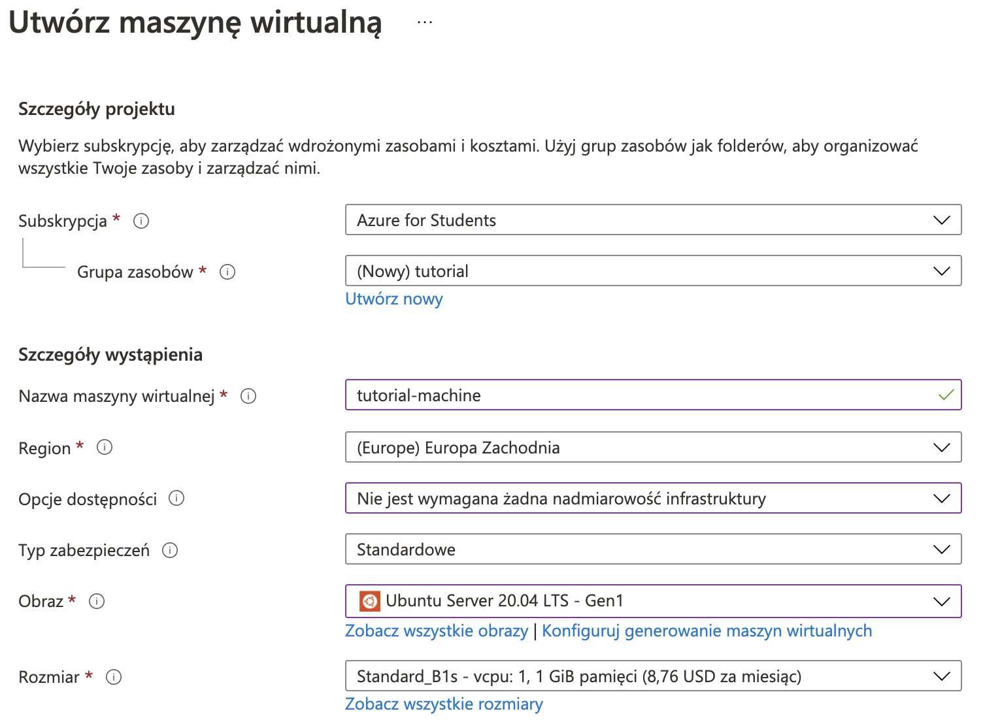
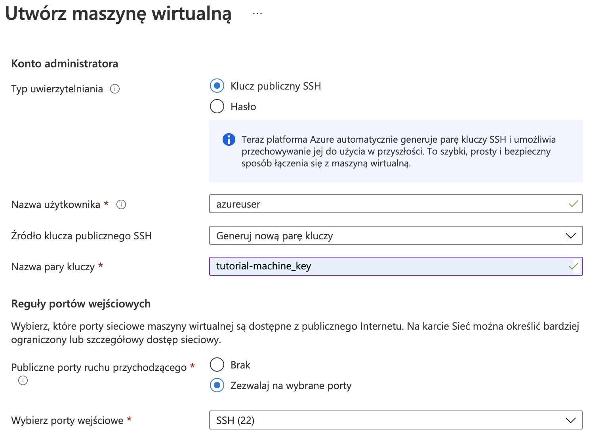
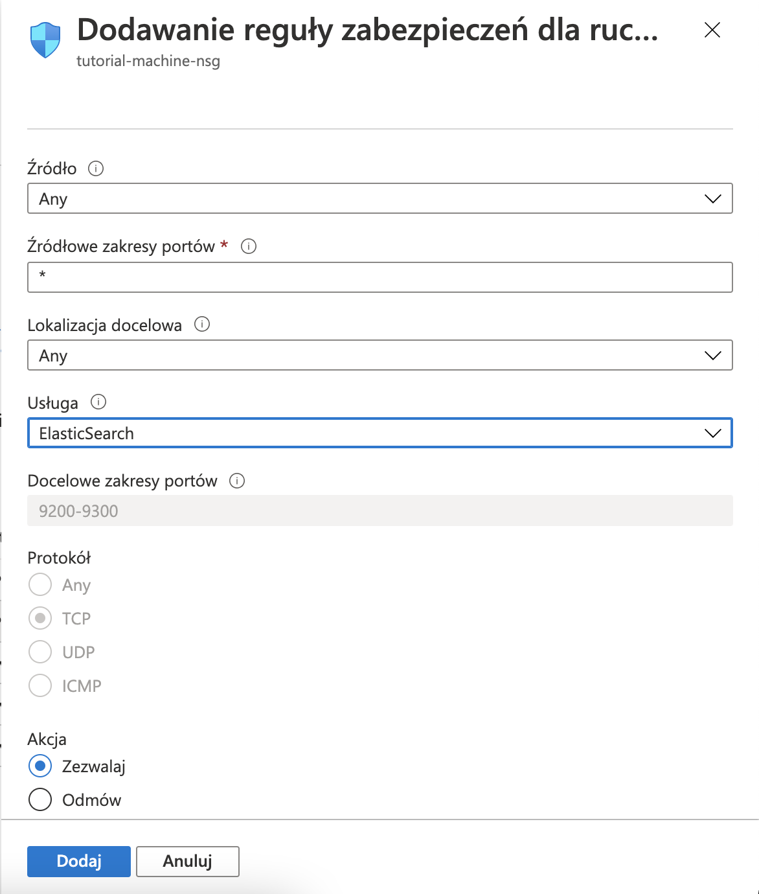
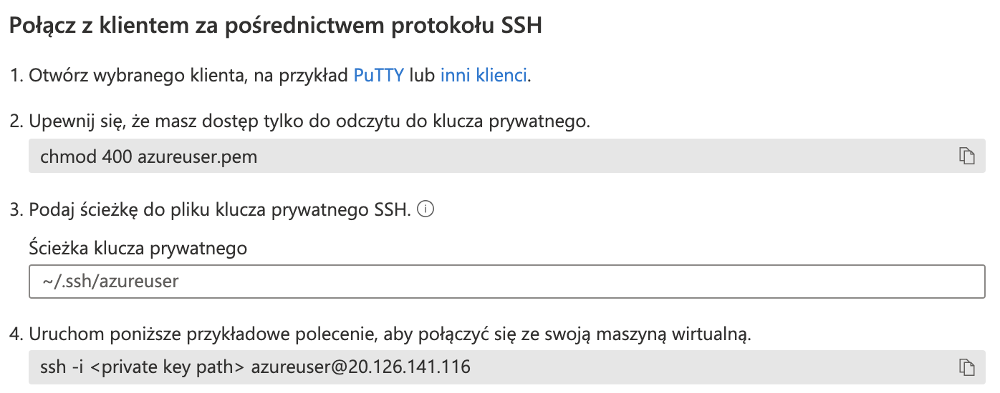
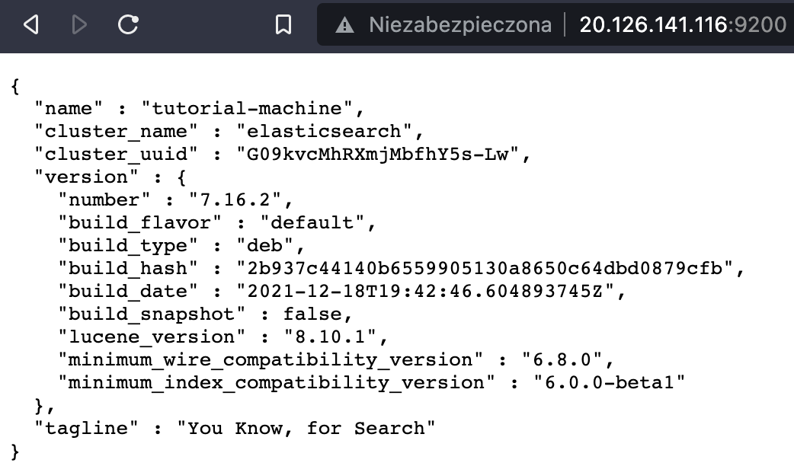
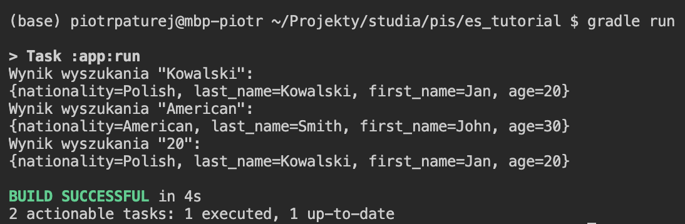

# Poradnik konfiguracji i korzystania z usługi Elasticsearch

W celu utworzenia zdalnego serwera Elasticsearch skorzystamy z portalu Azure. Jest na nim dostępna usługa, która automatycznie konfiguruje Elasticsearch na zdalnej maszynie, lecz nie jest ona dostępna w ramach darmowej subskrypcji Azure for Students, więc zamiast tego postawimy serwer na maszynie wirtualnej dostępnej za darmo. Rozwiązanie to jest też znacznie tańsze dla osób nie korzystających z tej subskrypcji (0.012 zamiast 0.40 USD/h).

## Tworzenie maszyny wirtualnej na Azure

Tworzenie maszyny wirtualnej zaczynamy od kliknięcia na "utwórz zasób" na stronie głównej serwisu lub bocznym menu, a następnie wyszukanie "maszyna wirtualna" w polu wyszukiwania i klikniecie "utwórz" na wyświetlonej stronie. Powinna nam się ukazać strona konfiguracji maszyny wirtualnej:



Wybieramy wykorzystywaną subskrypcję (jeśli nie mamy dostępu do usługi Azure for Students należy najpierw dodać metodę płatności). Tworzymy nową grupę zasobów o dowolnej nazwie, wpisujemy nazwę maszyny i wybieramy jej region. W ramach tego tutoriala będziemy korzystać z maszyny o rozmiarze Standard_B1s z systemem operacyjnym Ubuntu Server 20.04 LTS.

Następnie konfigurujemy konto administratora maszyny. Wybieramy pożądaną nazwę użytkownika i tworzymy parę kluczy.



Przechodzimy przez następne okna bez zmieniania domyślnych ustawień i klikamy przycisk "utwórz".

Przed połączeniem z maszyną otworzymy na niej porty wykorzystywane przez Elasticsearch. Wchodzimy w panel maszyny i w menu bocznym klikamy przycisk "sieć". Klikamy przycisk "Dodaj regułę portu wejściowego" i wybieramy usługę "Elasticsearch", a następnie klikamy "Dodaj".



Po utworzeniu maszyny łączymy się z nią poprzez klienta ssh w sposób opisany na poniższym zrzucie ekranu:



## Instalacja i konfiguracja usługi Elasticsearch na maszynie wirtualnej

Po połączeniu z serwerem instalujemy usługę Elasticsearch poprzez wpisanie poniższych komend kolejno (ich wyjaśnienie dostępne jest w [oficjalnym tutorialu Elasticsearch](https://www.elastic.co/guide/en/elasticsearch/reference/current/deb.html)):

```bash
wget -qO - https://artifacts.elastic.co/GPG-KEY-elasticsearch | sudo apt-key add -
sudo apt-get install apt-transport-https
echo "deb https://artifacts.elastic.co/packages/7.x/apt stable main" | sudo tee /etc/apt/sources.list.d/elastic-7.x.list
sudo apt-get update && sudo apt-get install elasticsearch
```

Aby usługa Elasticsearch na maszynie wirtualnej była dostępna z zewnątrz musimy wprowadzić pewne zmiany w pliku /etc/elasticsearch/elasticsearch.yml. Otwieramy go w wybranym edytorze tekstowym z uprawnieniami sudo, np za pomocą komendy

```bash
sudo vim /etc/elasticsearch/elasticsearch.yml
```

i dodajemy na samym dole linie:

```yml
network.host: 0.0.0.0
discovery.seed_hosts: ["0.0.0.0", "127.0.0.1"]
```

Jako że wykorzystywany przez nas serwer ma niewiele pamięci (1GiB), warto zmienić ilość pamięci, którą pozwalamy wykorzystywać usłudze Elasticsearch. W przeciwnym razie usługa może spowodować, że serwer będzie działał bardzo wolno. W tym celu dodajemy do pliku /etc/elasticsearch/jvm.options następujące linie:

```bash
-Xms256m
-Xmx256m
```

Do włączenia usługi elasticsearch wykorzystujemy komendę

```bash
sudo systemctl start elasticsearch.service
```

Po jej wykonaniu powinno być możliwe połączenie się z serwerem. W celu przetestowania połączenia łączymy się w przeglądarce ze stroną <http://{ip_serwera}:9200/>, w naszym przypadku <http://20.126.141.116:9200/>. Powinna nam się ukazać odpowiedź serwera elasticsearch:



## Tworzenie aplikacji w Javie wykorzystującej Elasticsearch

Następnie będziemy tworzyć prostą aplikację w Javie wykorzystującą nasz serwer Elasticsearch. Do stworzenia projektu wykorzystamy Gradle. Instrukcja instalacji gradle na różnych systemach operacyjnych dostępna jest na stronie <https://gradle.org/install/>.

Tworzymy nowy folder i wpisujemy w terminalu `gradle init`. Jako typ projektu wybieramy aplikację (wpisujemy `2`), a resztę opcji zostawiamy domyślnych (wciskamy enter aż do rozpoczęcia budowy projektu).

Do utworzonego pliku app/build.gradle dodajemy wymagane biblioteki. Zawartość tego pliku powinna wyglądać w następujący sposób:

```groovy
plugins {
    id 'application'
}

repositories {
    mavenCentral()
}

dependencies {
    implementation group: 'org.springframework.data', name: 'spring-data-elasticsearch', version: '4.3.0'
    implementation group: 'org.springframework', name: 'spring-web', version: '5.3.14'
    implementation group: 'org.slf4j', name: 'slf4j-simple', version: '1.7.32'
    implementation group: 'org.apache.logging.log4j', name: 'log4j-core', version: '2.16.0'
}

application {
    mainClass = 'es_tutorial.App'
}
```

Następnie będziemy edytować plik App.java utworzony w katalogu /app/src/main/java/{nazwa_projektu}. Dodajemy potrzebne importy i deklarujemy statyczny obiekt klienta ElasticSearch.

```java
import org.elasticsearch.action.index.IndexRequest;
import org.elasticsearch.action.search.SearchRequest;
import org.elasticsearch.action.search.SearchResponse;
import org.elasticsearch.client.RequestOptions;
import org.elasticsearch.client.RestHighLevelClient;
import org.elasticsearch.common.xcontent.XContentType;
import org.elasticsearch.index.query.QueryBuilders;
import org.elasticsearch.search.SearchHit;
import org.elasticsearch.search.builder.SearchSourceBuilder;
import org.springframework.data.elasticsearch.client.ClientConfiguration;
import org.springframework.data.elasticsearch.client.RestClients;

public class App {
    static RestHighLevelClient client;
```

W metodzie main inicjalizujemy klienta i łączymy go z naszym serwerem.

```java
public static void main(String[] args) throws IOException {
    ClientConfiguration clientConfiguration = ClientConfiguration.builder().connectedTo("20.126.141.116:9200")
            .build();
    client = RestClients.create(clientConfiguration).rest();
```

Tworzymy metodę dodającą do serwera indeks o podadej nazwie i zawartości.

```java
public static String addIndex(String indexName, String jsonString) throws IOException {
    IndexRequest request = new IndexRequest(indexName);
    request.source(jsonString, XContentType.JSON);
    return client.index(request, RequestOptions.DEFAULT).getId();
    }
```

W celach przykładowych dodamy do serwera pewne zmyślone dane osobowe. W funkcji main wywołujemy napisaną metodę.

```java
addIndex("people",
        "{\"first_name\": \"Jan\", \"last_name\": \"Kowalski\", \"age\": 20, \"nationality\": \"Polish\"}");
addIndex("people",
        "{\"first_name\": \"John\", \"last_name\": \"Smith\", \"age\": 30, \"nationality\": \"American\"}");
```

Następnie dodajemy metody pozwalające na wyszukanie danych za pomocą tekstowego zapytania i wyświetlenie pasujących wyników.

```java
public static SearchResponse search(String query) throws IOException {
    SearchSourceBuilder builder = new SearchSourceBuilder();
    builder.query(QueryBuilders.queryStringQuery(query));
    SearchRequest searchRequest = new SearchRequest();

    searchRequest.source(builder);
    SearchResponse response = client.search(searchRequest,
            RequestOptions.DEFAULT);
    return response;
}

public static void printSearchResults(String query) throws IOException {
    System.out.println("Wynik wyszukania \"" + query + "\":");
    SearchHit[] searchhits = search(query).getHits().getHits();
    for (SearchHit hit : searchhits) {
        System.out.println(hit.getSourceAsMap());
    }
}
```

W funkcji main wywołujemy metodę printSearchResults kolejno dla argumentów "Kowalski", "American" i "20" i kończymy pracę klienta.

```java
        printSearchResults("Kowalski");
        printSearchResults("American");
        printSearchResults("20");

        client.close();
    }
}
```

Możemy nareszcie sprawdzić, czy nasza aplikacja korzystająca z Elasticsearcha działa poprawnie! Uruchamiamy ją za pomocą polecenia `gradle run`



## Wykorzystywane źródła

- <https://www.baeldung.com/elasticsearch-java>
- <https://docs.gradle.org/current/samples/sample_building_java_libraries.html>
- <https://www.elastic.co/guide/en/elasticsearch/reference/current/deb.html>
- <https://www.elastic.co/guide/en/elasticsearch/client/java-rest/current/java-rest-high.html>
